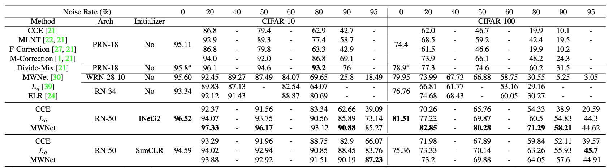

# Contrastive Learning Improves Model Robustness Under Label Noise

This is an official repository of the paper [Contrastive Learning Improves Model Robustness Under Label Noise](https://arxiv.org/pdf/2104.08984.pdf) to be presented at Learning from Limited or Imperfect Data (L^2ID) Workshop @ CVPR 2021. 


`In this paper, we show that by initializing supervised robust methods using representations learned through contrastive learning leads to significantly improved performance under label noise. Surprisingly, even the simplest method (training a classifier with the CCE loss) can outperform the state-of-the-art SSL method by more than 50% under high label noise when initialized with contrastive learning.`

Here is a snippet of the experimental results on CIFAR datasets under symmetric label noise. 



## Environment Setup
This repository uses the following packages in Python3.
```
torch==1.7.1
torchvision==0.8.2
higher==0.2.1
```

## Training
You can download the pre-trained models from [Onedrive](https://umass-my.sharepoint.com/:u:/g/personal/arighosh_umass_edu/EQ3vh_THjDlLtZyXw_bZ3cYB07-n2dekhdMO3VZzy_vmNg?e=aMCvnG).

The `pretrained.zip` file contains three SimCLR pre-trained models for CIFAR-10, CIFAR-100, and Clothing1M dataset. These models are trained using this excellent [Pytorch implementation for SimCLR](https://github.com/AndrewAtanov/simclr-pytorch). The `pretrained.zip` file also contains the configs for training those models. Note, input to the SimCLR model were not normalized

The `pretrained.zip` file also contains an ImageNet32 pre-trained model on ResNet-50 architecture (with changing the first conv layer of kernel size 7 with a kernel size of 3 and removing the first max-pool operation.) Alternatively, you can run `imagenet32.py` on [ImageNet32 dataset](https://patrykchrabaszcz.github.io/Imagenet32/) This ImageNet32 pre-trained model was used to initialize for CIFAR datasets. For the clothing1M dataset, directly use PyTorch pre-trained ImageNet model. ImageNet pre-trained initialization expects normalized inputs. 

I added configs file for the three datasets in `config/` folder. Unzip `pretrained.zip` in `../` folder. Run,
```(bash)
python train.py\
    --config config/<name of datasets>.yaml\
    --corruption_prob {corruption_prob}\ 
    --corruption_type {corruption_type}\ 
    --encoder_type {encoder_type: imagenet or simclr}\
    --problem {problem: mwnet or finetune}\
    --loss {loss: ce or qloss}\
    --q {q}\
    --seed {seed}\
    --neptune --cuda 
```
To run with the CCE loss or generalized cross-entropy loss, use `--loss ce` or `--loss qloss` and `--problem finetune`. For meta-weight-net use  `--loss ce` and `--problem mwnet`. For parameter ranges, check the `scheduler.py` file. 

## [MetaWeight Network](https://arxiv.org/abs/1902.07379) implementation

I simplified the official [implementation](https://github.com/xjtushujun/meta-weight-net) using [higher](https://github.com/facebookresearch/higher) package. You can use any architecture without needing to write separate custom meta modules.

There are a couple of differences with the official implementation; however, you can simply change these to follow the original [code](https://github.com/xjtushujun/meta-weight-net) from the author. 
- Line 351 in `models/noisy_models.py`, I am using a constant inner learning rate (instead of the classifier learning rate). 
- Line 377 in `models/noisy_models.py`, I am using the sum of the weighted loss for the meta samples (instead of normalized weighted loss). 
- You can try with other loss functions for the meta samples; I added MAE loss in Line 366 in `models/noisy_models.py` as they are shown to be superior without the need for clean meta samples, in this [paper](https://openaccess.thecvf.com/content/WACV2021/papers/Ghosh_Do_We_Really_Need_Gold_Samples_for_Sample_Weighting_Under_WACV_2021_paper.pdf)

## [Generalized Cross-entropy loss](https://arxiv.org/abs/1805.07836) implementation
I do not use the truncated version of the generalized cross-entropy loss. Instead, the generalized cross-entropy loss is applied directly; and they perform remarkably well with the right initializer (otherwise, not so much!). 

## Training

## Attribution
Parts of this code are based on the following repositories:
- [SimCLR PyTorch](https://github.com/AndrewAtanov/simclr-pytorch), [PyTorch Lightning](https://github.com/PyTorchLightning/pytorch-lightning) for standard backbones, training loops, and SimCLR model training.
- [Meta-Weight-Net: Learning an Explicit Mapping For Sample Weighting (Official Pytorch implementation for noisy labels](https://github.com/xjtushujun/meta-weight-net) for the original implementation of MetaWeight Network.
- [Higher Package](https://github.com/facebookresearch/higher) for simplifying the Metaweight network implementation. 


## Citation
If you find this code useful in your research then please cite  
```(bash)
@InProceedings{Ghosh_2021_CVPR_Workshops,
author    = {Ghosh, Aritra and Lan, Andrew},
title = {Contrastive Learning Improves Model Robustness Under Label Noise},
booktitle = {Proceedings of the IEEE/CVF Conference on Computer Vision and Pattern Recognition (CVPR) Workshops},
year = {2021}
}

``` 

Contact:  Aritra Ghosh (aritraghosh.iem@gmail.com).
